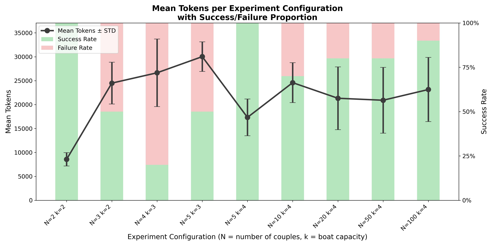

# Rethinking The Illusion of Thinking

This project, **Rethinking The Illusion of Thinking**, is inspired by the Apple research paper ["The Illusion of Thinking"](https://machinelearning.apple.com/research/illusion-of-thinking) by Parshin Shojaee et al. The paper sparked significant debate in the AI community:

- **Critics** questioned the methodology and conclusions.
- **Supporters** argued that Large Reasoning Models (LRMs) fundamentally lack reasoning abilities.

Unconvinced by either side, I revisited the experiments with restructured setups and ablation tests to explore alternative reasoning dynamics.

## Author

- **Iñaki Dellibarda Varela**  
    Email: [i.dellibarda@car.upm-csic.es](mailto:i.dellibarda@car.upm-csic.es)

## Motivation

About 10 days ago, Apple released one of the most controversial papers in recent memory: *The Illusion of Thinking*. The community response was divided, with debates about whether LRMs truly lack reasoning or if experimental design was at fault.

Curious, I decided to replicate and extend the experiments, focusing on two classic puzzles: **River Crossing** and **Towers of Hanoi**, using Gemini 2.5-Pro. Rather than simply reproducing the original experiments, I introduced structural modifications and ablation tests to probe the models' reasoning abilities more deeply.

## Experimental Approach

### Towers of Hanoi

Reproduction attempts suggest that LLMs do not fail due to reasoning deficits alone. As the number of disks increases, the solution length grows exponentially, often exceeding the model’s output limits. Aware of this, I reframed the problem as a stepwise process: the model generates a few moves at a time, using its previous output as the current state. This ensures that any failure is due to reasoning limitations, not output length constraints.

Additionally, I explored collaborative problem-solving by setting up a dialogue between two LRMs, equipped with shared memory, in-context learning, and agentic behavior.

### River Crossing

The original paper’s River Crossing benchmark was heavily criticized, as many test cases were unsolvable. To address this, I reran the experiments using only solvable initial states, providing a fairer assessment of the models' reasoning capabilities.

---

This project aims to provide a nuanced perspective on the reasoning abilities of large language models, moving beyond the limitations and controversies of the original experiments.

## Results

### Towers of Hanoi

- For up to 8–9 disks, the model reliably produced valid move sequences in stepwise mode.
- Beyond 9 disks, even with minimal step sizes, the model began to generate invalid moves and broke the puzzle’s rules.
- Collaborative setups (two LRMs with shared memory and agentic behavior) did not improve performance; models lost track of state and made inconsistent decisions.

### River Crossing

- When eliminating unsolvable states, the model successfully solved all tested instances, including those with up to 100 jealous couples.
- The model generated long, correct move sequences without errors, demonstrating strong performance on this benchmark when the problem was well-posed.
### River Crossing: Results Chart

After filtering out unsolvable test cases—using formal criteria from Efimova (2018)—the model was evaluated exclusively on valid configurations. The chart below summarizes results for representative problem setups:



Key observations:

- **Complexity vs. Token Usage:** As the problem configuration becomes more complex (larger N, smaller k), the number of tokens generated by the model increases, reflecting longer reasoning chains.
- **Critical Threshold:** For boat capacity \( k = 3 \), the hardest instance tested (\( N = 5 \)) was theoretically solvable but the model failed every time, highlighting a clear performance boundary.
- **Plateau Effect:** With \( k = 4 \), the model consistently solved all tested instances—even for large \( N \) (10, 50, 100)—and token usage stabilized, indicating that increasing the number of couples does not significantly increase reasoning complexity once the critical boat size is reached.
- **Contrast with Prior Work:** These findings differ sharply from Shojaee et al., where River Crossing was the worst-performing task—likely due to the inclusion of unsolvable cases.

This analysis demonstrates that, when evaluated on well-posed instances, the model exhibits robust reasoning capabilities on the River Crossing benchmark.


## Code Overview: Towers of Hanoi

To get started with the code, first navigate to the project directory:

```bash
cd HanoiTowers
```

There are four key Python files related to the Towers of Hanoi experiments:

- **HanoiTowersViewers.py**: Contains a class for graphical visualization of solutions and recording associated videos.

- **HanoiTowersSolver.py**: Implements the traditional recursive solution to the Towers of Hanoi problem, as described in the original paper.  
    **To run:**  
    ```bash
    python HanoiTowersSolver.py
    ```

- **HanoiTowersSolverSteps.py**: Implements the stepwise process. Instead of asking the LLM to solve the entire puzzle in one request, the problem is divided into multiple independent requests. Each request starts from the current state and asks the LLM to generate a specified number `p` of moves. At the end of the code (lines 148 and 149), you will find two variables: `N` (number of disks) and `p` (number of moves per LLM call).  
    **To run:**  
    ```bash
    python HanoiTowersSolverSteps.py
    ```

- **HanoiTowersSolverConver.py**: Solves the Towers of Hanoi via a conversational approach between two LLMs. Again, at the end of the code (lines 212 and 213), you will find the variables `N` and `p`.  
    **To run:**  
    ```bash
    python HanoiTowersSolverConver.py
    ```

**Important:**  
At the beginning of each script, you will see the following command:

```python
genai.configure(api_key=os.getenv("GEMINI_API_KEY_HANOI"))
```

Replace `GEMINI_API_KEY_HANOI` with the name of the environment variable that stores your Gemini API key. If you do not have an API key, you can obtain one here: [https://ai.google.dev/gemini-api/docs/api-key?hl=es-419](https://ai.google.dev/gemini-api/docs/api-key?hl=es-419)

## Code Overview: River Crossing

To get started with the River Crossing experiments, first navigate to the project directory:

```bash
cd RiverCrossing
```

There are three main Python files related to the River Crossing experiments:

- **RiverCrossingViewer.py**: Provides graphical visualization of solutions and records videos of the problem-solving process.
- **RiverCrossingSolver.py**: Solves the River Crossing problem. If an invalid (unsolvable) configuration is provided, the script will raise an error. At the end of the code (lines 142 and 143), you can set the variables `N` (number of jealous couples) and `k` (boat capacity, i.e., the maximum number of individuals allowed on the boat). After solving the problem, the script automatically generates a video of the solution in the `videos` directory.
    **To run:**  
    ```bash
    python3 RiverCrossingSolver.py
    ```
- **MultipleSolution.py**: Allows you to verify whether a given list of moves correctly solves the problem. This is useful because sometimes `RiverCrossingSolver.py` generates the correct sequence of moves, but due to the output format provided by the LLM, the code cannot extract the move list, resulting in an error. To use this script, adjust the values of `N`, `k`, and `moves` (lines 65 to 69).
    **To run:**  
    ```bash
    python3 MultipleSolution.py
    ```

**Important:**  
At the beginning of each script, you will see the following command:

```python
genai.configure(api_key=os.getenv("GEMINI_API_KEY_HANOI"))
```

Replace `GEMINI_API_KEY_HANOI` with the name of the environment variable that stores your Gemini API key. If you do not have an API key, you can obtain one here: [https://ai.google.dev/gemini-api/docs/api-key?hl=es-419](https://ai.google.dev/gemini-api/docs/api-key?hl=es-419)

## Demo Video

A demonstration of the experiments can be viewed below:

[](https://www.youtube.com/watch?v=8yBV5w_Ubuo)